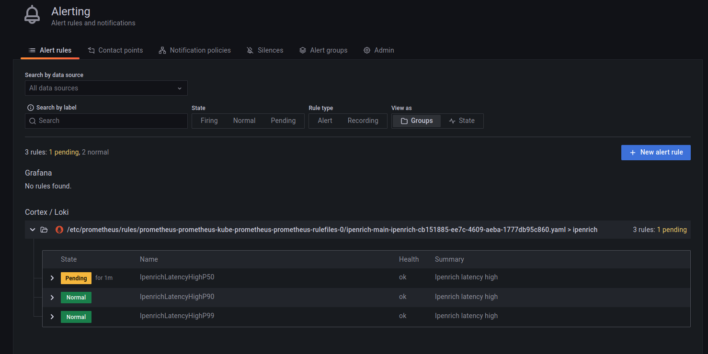

# ip enrich 
This applicaton provide ip address to asn(autonomous system number) lookup based maxmind asn database

# Prerequisites
ubuntu 20.04

docker 20.10+

git

make
```
make install-kubectl    # Install kubectl
make install-helm       # Install helm
make install-kind       # kind minimal kubernetes for local development
make install-cst        # Install container structure test 
```
The bellow step allow to deploy application on kind kubernetes cluster that is lightweight kubernetes distrubition.
```
make deploy-cluster     # Deploy kind cluster with local registry
make deploy-ingress     # Deploy nginx ingress controller
make deploy-opa         # Deploy open policy agent
make build-container    # Build the container
make push-container     # Push container to local registry and test cst
make deploy-prometheus  # Deploy prometheus operator and prometheus
make deploy-app         # Deploy application to kind kubernetes 
make perform-test       # Performance test, expected requests per second bigger than 10000
curl -H "Host: chart-example.local" http://127.0.0.1/?ip=8.8.8.8 # Test application
```
# TODO
- [x] Implement logging layer in application
- [x] Deploy log system EFK or fluentbit,loki,grafana
- [x] Add maxmind city, country database
- [x] Implement response latency prometheus metric
- [x] Deploy and remove tekton
- [x] Create CI pipeline using tekton
- [ ] Create CD pipeline using argo rollout
- [x] Install argo rollout for canary deployment 
- [x] Implement prometheus service monitor
- [x] Deploy alertmanager and grafana for alert management system
- [x] Implement prometheus rule for alert and integrate alertmanager to oncall system
- [x] Implement Network policy
- 
```
Below make functions
help                           This help.
build-container                Build the container
push-container                 Push container to local registry
run-container                  Run container for the test
stop-container                 Stop and remove a running container
clean                          Clean container 
install-kind                   kind minimal kubernetes for local development
install-kubectl                Install kubectl 
install-helm                   Install helm
install-cst                    Install container structure test 
deploy-app                     Deploy application to kind kubernetes 
deploy-cluster                 Deploy kind cluster with local registry
deploy-ingress                 Deploy nginx ingress controller
deploy-metricserver            Deploy metric server for enable HPA. 
deploy-opa                     Deploy open policy agent
deploy-prometheus              Deploy prometheus operator
delete-app                     Delete application from kind kubernetes 
delete-cluster                 Destroy kind cluter
delete-ingress                 Delete nginx ingress controller
delete-metricserver            Delete metric server 
delete-opa                     Deploy open policy agent
delete-prometheus              Delete prometheus operator
perform-test                   Performance test, expected requests per second bigger than 10000
test-app                       Test deployed app
test-cst                       Test container structure
```


# Tekton CI Report
tkn pipelinerun describe -n ipenrich-main pipeline-run-jm2h7
Name:              pipeline-run-jm2h7
Namespace:         ipenrich-main
Pipeline Ref:      pipeline
Service Account:   default
Timeout:           1h0m0s
Labels:
 tekton.dev/pipeline=pipeline

🌡️  Status

STARTED          DURATION   STATUS
11 minutes ago   11m21s     Succeeded

⚓ Params

 NAME                 VALUE
 ∙ CI_COMMIT_BRANCH   main
 ∙ CI_PROJECT_NAME    ipenrich
 ∙ CI_PROJECT_PATH    ipenrich-main
 ∙ CI_PROJECT_URL     https://github.com/supu2/ipenrich
 ∙ DOCKERCONTEXT      .
 ∙ DOCKERFILE         Dockerfile
 ∙ HELMFOLDER         helm
 ∙ IMAGE              172.17.0.1:5001/ipenrich
 ∙ TRIVY_IMAGE_PATH   .

📂 Workspaces

 NAME                 SUB PATH   WORKSPACE BINDING
 ∙ shared-workspace   ipenrich   PersistentVolumeClaim (claimName=shared-workspace-pvc)

🗂  Taskruns

 NAME                                           TASK NAME                 STARTED          DURATION   STATUS
 ∙ pipeline-run-jm2h7-trivy-scanner-container   trivy-scanner-container   2 minutes ago    2m53s      Succeeded
 ∙ pipeline-run-jm2h7-build-image               build-image               6 minutes ago    3m21s      Succeeded
 ∙ pipeline-run-jm2h7-kube-linter               kube-linter               8 minutes ago    17s        Succeeded
 ∙ pipeline-run-jm2h7-trivy-scanner             trivy-scanner             8 minutes ago    49s        Succeeded
 ∙ pipeline-run-jm2h7-container-best-practise   container-best-practise   8 minutes ago    15s        Succeeded
 ∙ pipeline-run-jm2h7-secret-detection          secret-detection          8 minutes ago    2m11s      Succeeded
 ∙ pipeline-run-jm2h7-fetch-repository          fetch-repository          11 minutes ago   2m56s      Succeeded